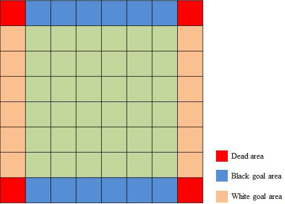
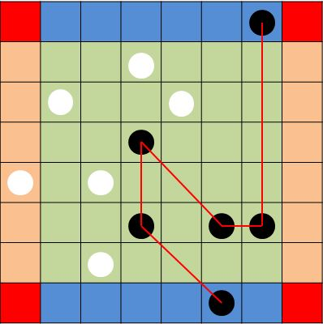
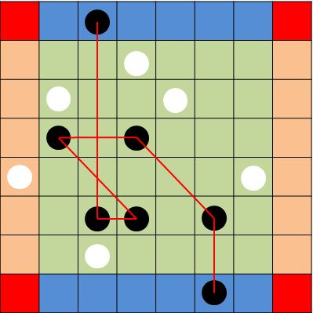
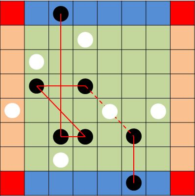
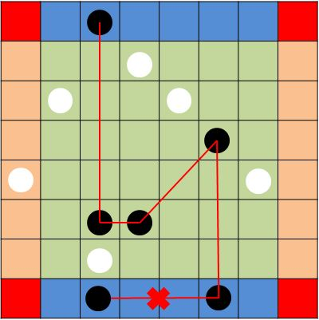
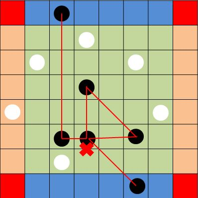
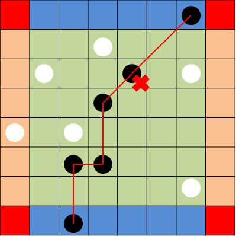
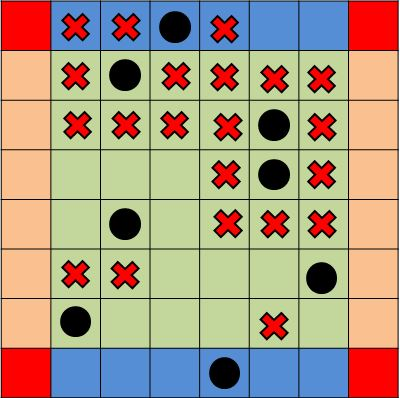

# Network

**Network** is a board game where each player tries to make an unbroken path of pieces from one end of the board to the other. This project allows you to play the Network game against a machine player.

### How to play

##### Game board
Network is played on a 8-by-8 board. There are two players: a player with black chips and the other with white chips. The player with white chips moves first.

The 8-by-8 board has four goal areas and four corner areas, as shown in Figure 1. The black goal areas can only be used by black chips. And the white goals areas can only be used by white chips. Neither player can use the dead areas. Either player can place a chip in any square not on the boarder.

<p align="center"></p>

##### Object of play
Each player tries to complete a "network" that joins the player's two goal areas. Such a "network" is a sequence of six or more chips that starts from one of the player's goal areas and ends in the other. Each consecutive pair of chips in the "network" are connected to each other along straight lines, eigher orthogonally (left, right, up, down) or diagonally.Here are two winning configurations for black chip.

<p align="center"> 
</p>

There are more rules for a qualified "network":

  - An enemy chip placed in the straight line between two chips breaks the connection.

<p align="center"></p>

  - A "network" can have only two chips in the goal areas: the first and last chips in the "network".

<p align="center"></p>

  - A "network" cannot pass through the same chip twice, even if it is only counted once.

<p align="center"></p>

  - A "network" cannot pass through a chip without turning a corner.

<p align="center"></p>


##### Legal moves
To begin the game, choose who uses black chips and who uses white chips. Then the two players take turns to move, with White moves first.

There are four rules of legal play:
  - No chip can be placed in any of the four corner areas.
  - No chip can be placed in the enemy's goal areas.
  - No chip can be placed in a square that is already occupied.
  - A player may not have more than two chips in a connected group, whether connected orthogonally or diagonally. Two or more chips form a connected group if one of them is adjacent to the others. For example, in the following board, a black chip is not permitted to be placed in any of the squares marked with an X, because doing so would form a connected group of three or more chips.

<p align="center"></p>

There are two kinds of moves: add moves and step moves. In an add move, a player places a chip on the board (following the rules above). Each player has ten chips, and only add moves are permitted util those chips are exhausted. If neither player has won when all twenty chips are on the board, the rest of the game comprises step moves. In a step move, a player moves a chip to a different square, subject to the same restrictions.

### Run the game

Play with the machine player:
```sh
$ java Network human machine
```

Play with a naive machine player:
```sh
$ java Network human random
```

Play with another human player:
```sh
$ java Network human human
```
### Todos
  - Implement a web interface (working on this now)
  - Optimize the strategy of the machine player
  - Use hashtable to record boards to reduce search time
  - Add difficuty levels for the human player

### Reference
This is a course project of UC Berkeley CS61B. All the *.class files and picture files in the pics folder and some descriptions about how to play the game are from the online course (https://people.eecs.berkeley.edu/~jrs/61bf06/).